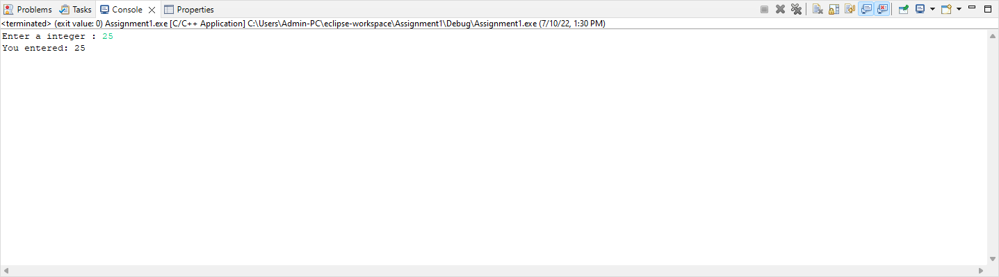

# Homework 1 - EX2

```
EX2:

Write C Program to Print a Integer Entered by a User
i should see the Console as following:
##########Console-output###
Enter a integer: 25
You entered: 25
###########################
```

# Output

