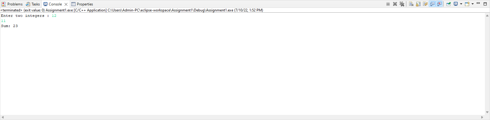

# Homework 1 - EX3

```
EX3:

Write C Program to Add Two Integers

i should see the Console as following:
##########Console-output###
Enter two integers: 12
11
Sum: 23
###########################
```

# Output

