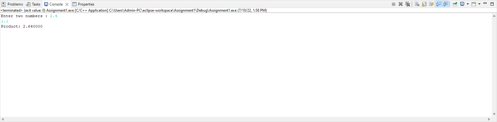

# Homework 1 - EX4

```
EX4:

Write C Program to Multiply two Floating Point Numbers
i should see the Console as following:
##########Console-output###

###########################
Enter two numbers: 2.4
1.1
Product: 2.640000
########################################################################
```

# Output

