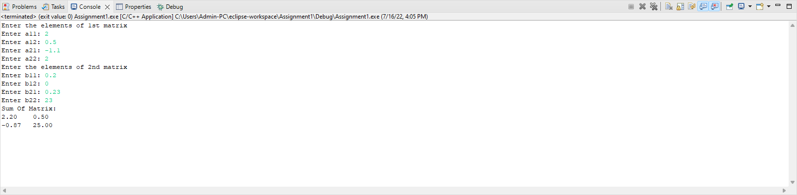

# Homework 3 - Arrays- EX1

```
Write a C program to find sum of two matrix of order 2*2 using multidimensional arrays where, elements of matrix are entered by user.

output:
Enter the elements of 1st matrix
Enter a11: 2;
Enter a12: 0.5;
Enter a21: -1.1;
Enter a22: 2;
Enter the elements of 2nd matrix
Enter b11: 0.2;
Enter b12: 0;
Enter b21: 0.23;
Enter b22: 23;

Sum Of Matrix:
2.2     0.5
-0.9    25.0
```

# Output

