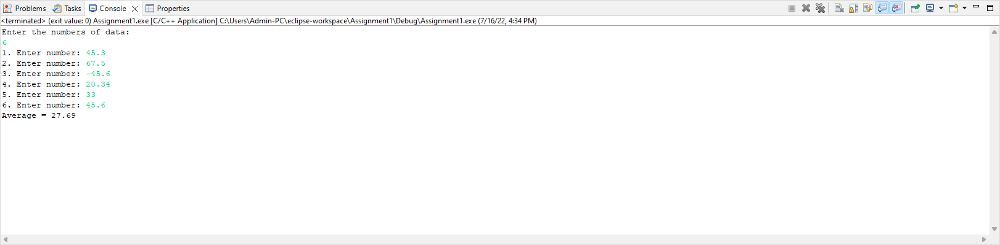

# Homework 3 - Arrays- EX2

```
This program takes n number of element from the user(where, n us specified by user), stores data in an array and calculates the average of those numbers.

Output:

Enter the number of data: 6
1. Enter number: 45.3
2. Enter number: 67.5
3. Enter number: -45.6
4. Enter number: 20.34
5. Enter number: 33
6. Enter number: 45.6
Average = 27.69
```

# Output

